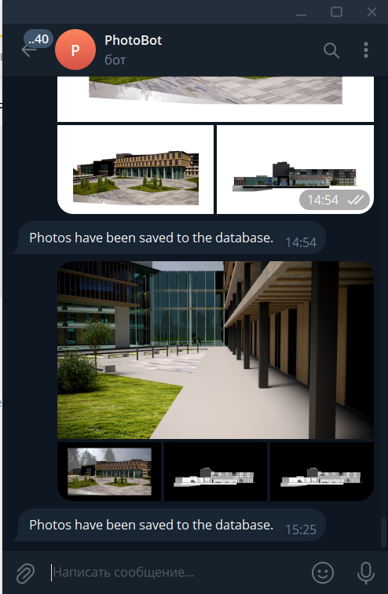
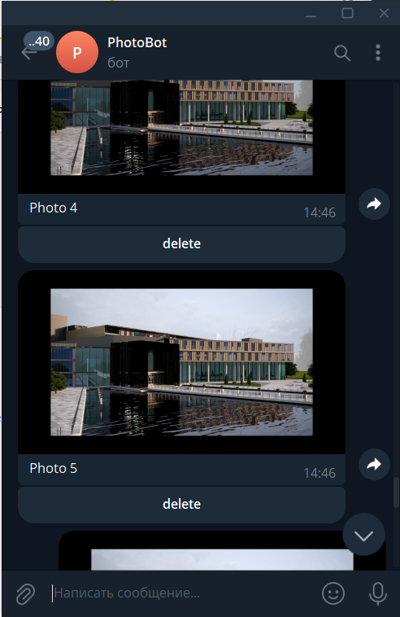

@send_me_photos_BOT
name: PhotoBot

Ulyana Akinfina

Telegram bot for sending messages. It saves photos to the database as a byte code. And it gives it away at the user's request with the possibility of deletion.

Commands:
/start - Starting to work.
/help - Help with information.
/my_photos - I'll give you all your photos.
You can click the delete button under the photo and I'll delete it.

Technologies: Aiogram FastAPI Sqlite(+sqlalchemy)
29.05.2024